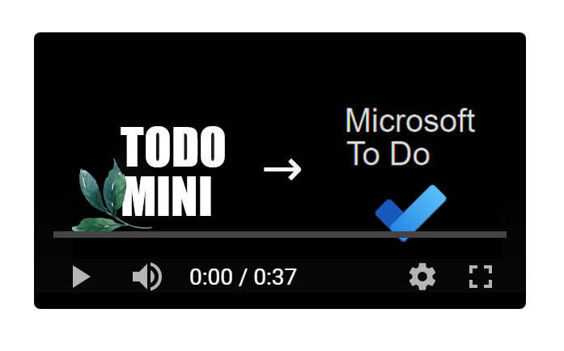

# ToDo Mini to Microsoft ToDo utility

This is a utility for copying tasks from ToDo Mini to Microsoft ToDo.

Steps:
1. Place ToDoMiniToToDo.cs in you Unity project, preferably inside of an Editor folder
2. Open the utility (from Unity: Window > Tools > ToDo Mini to ToDo)
3. Click "Get data 9-1 ✔" to get the data in reverse order
4. Click "Copy data"
5. Run "Mini to ToDo copypaste.ahk" (this is an AutoHotKey script. You'll need AutoHotKey installed: https://www.autohotkey.com/ )
6. Inside of Miscrosoft ToDo, go inside of the list where you want to paste tasks, click inside of the task area, then press ctrl+space to paste all of the tasks inside of the list.
7. Exit the AutoHotKey script (in the Windows task bar, right click the script icon and select "Exit")

